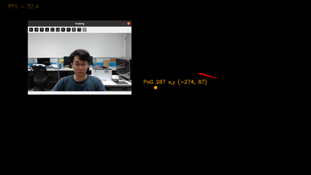

# EVG : Efficient End-to-End Virtual Plane Gaze Estimation
A novel End-to-end gaze estimation method, by utilizing the virtual plane, to predict the probability distribution of gaze locations.

  

  

<!-- ## Updates -->

## Abstract 

Recent studies in gaze estimation have made significant progress, but current methods often involve complex pre-processing steps, e.g., cropping the eye, facial regions, and data normalization. These steps increase training and inference time and aren't suitable for embedded devices with computational constraints. In this paper, we propose an End-to-end virtual plane 2D Point-of-Gaze (PoG) estimation method that directly estimates gaze probability distribution on a virtual plane from full-frame images, preserving latent features across human eye gaze, camera, and screen. We establish a virtual plane considering spatial information of the camera and screen, and the model learns the gaze regression relationship between facial images and the virtual plane through training. Our method tackles challenges like complex backgrounds and multi-scale issues through model architecture design and integrates an auxiliary face heatmap branch to prioritize facial regions, improving adaptability to complex backgrounds and overall performance. We evaluated our method on three public gaze datasets: EVE, GazeCapture and MPIIFaceGaze, achieving state-of-the-art results on EVE and MPIIFaceGaze. By employing a lightweight model backbone, we ensure both efficiency and performance.

Keywords: Gaze Estimation, Eye Tracking, Virtual Plane

## Contributions

- A novel End-to-end gaze estimation method, by utilizing the virtual plane, to predict the probability distribution of gaze locations.
- Effectively tackles the challenges of End-to-end schemes like complex backgrounds and multi-scale imagery. 
- EVG achieve state-of-the-art performance on MPIIFaceGaze and EVE , achieving efficiency gains of 5% and 8%, respectively.
- Conduct various experiments to achieve the best trade-off between accuracy and model size for embedded applications.
- Ablation experiments on the auxiliary face heatmap branch were conducted, resulting in improved performance. Notably, the auxiliary branch is only activated during training, so it does not increase model size during inference.

## Main results

### EVE

| Method                   | Input     | End-to-End | PoG(pixel)↓ |
| ------------------------ | --------- | ---------- | ----------- |
| EyeNet (static) [EFE]    | Right Eye |            | 181.00      |
| EyeNet (static) [EFE]    | Left Eye  |            | 172.70      |
| Direct Regression [EFE]  | Frame     | v          | 143.83      |
| EFE (static)             | Frame     | v          | 133.73      |
| EVG (our)                | Frame     | v          | **133.63**  |
| EVG + Face heatmap (our) | Frame     | v          | **112.49**  |

### MPIIFaceGaze
| Method    | Input       | End-to-End | PoG(mm)↓  |
| --------- | ----------- | ---------- | --------- |
| iTracker  | Face & Eyes |            | 54.60     |
| Full-Face | Face        |            | 42.00     |
| AFF-Net   | Face & Eyes |            | 39.00     |
| EFE       | Frame       | v          | 38.90     |
| EVG (our) | Frame       | v          | **36.75** |

### GazeCapture
| Method                  | Input       | End-to-End | Phone PoG(cm)↓ | Tablet PoG(cm)↓ |
| ----------------------- | ----------- | ---------- | ----------------- | ------------------ |
| iTracker                | Face & Eyes |            | 2.04              | 3.32               |
| SAGE                    | Eyes        |            | 1.78              | 2.72               |
| AFF-Net                 | Face & Eyes |            | **1.62**          | **2.30**           |
| EFE                     | Frame       | v          | **1.61**          | 2.48               |
| EVG (our)               | Frame       | v          | 1.66              | 3.90               |
| EVG + Face heatmap(our) | Frame       | v          | **1.59**          | 3.83               |

<!-- All models and details are available in our [Model zoo](readme/MODEL_ZOO.md). -->

## Installation
Please refer to [INSTALL.md](readme/INSTALL.md) for project Installation. 

## Project tutorial and development
Please refer to [TUTORIAL.md](readme/tutorial/TUTORIAL.md) for code tutorial.   
Please refer to [DEVELOP](readme/DEVELOP.md) for a basic idea of project development. 

## Plot dataset distribution in chart / figure

Each folder has a README.md file to guide you in plotting the related dataset distribution in a figure or chart  
[Plot](plot)  

~~~
${CenterNet_ROOT}/  
└── plot/  
    └── line_chart 
    └── violin_chart
        └── EVE
        └── GazeCapture
        └── MPIIFaceGaze
        └── MPIIFaceGaze_dataset_original
~~~