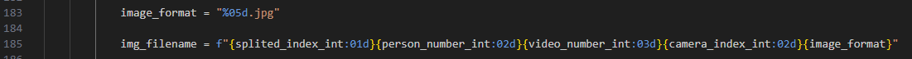
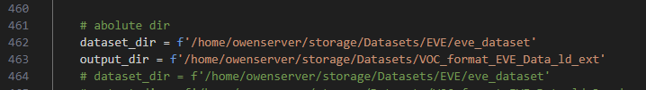
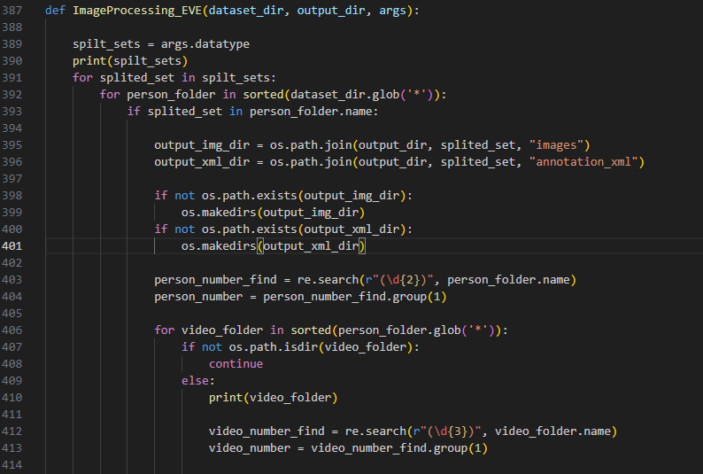
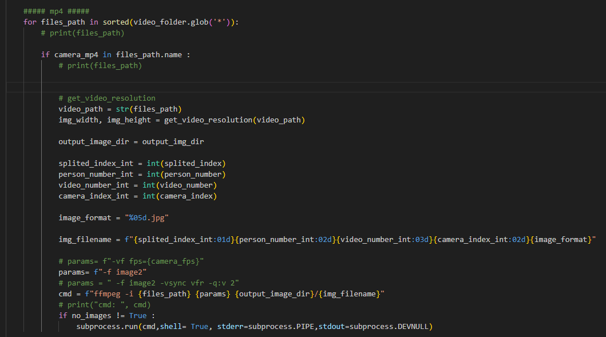
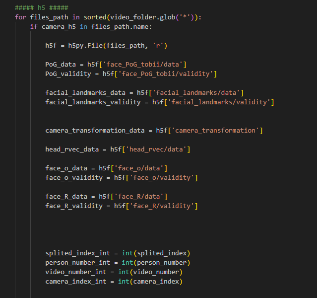
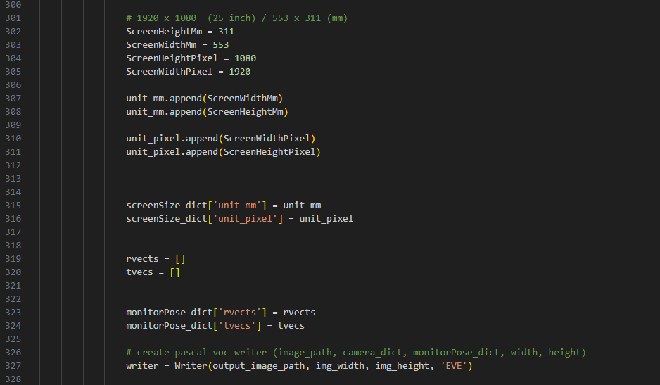
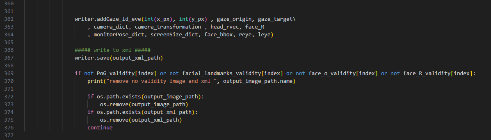
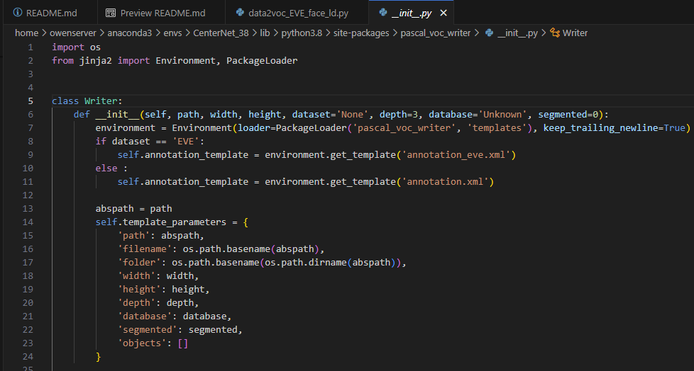
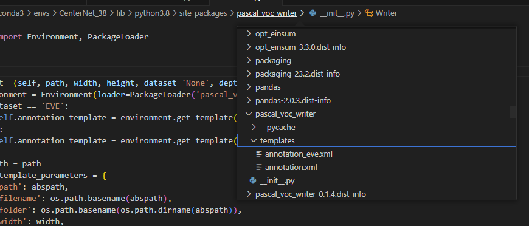
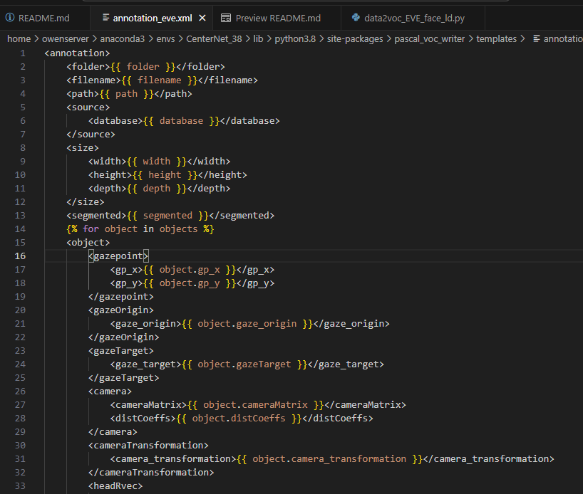

功能
---
用於將EVE dataset 做第一階段的前處裡，由EVE的h5->voc，會將EVE 的影像mp4 透過ffmpeg 分割為指定Hz 數量，ex 30Hz -> 30張，並且將特定需要用的annotation資料轉換為xml格式  
共有兩個程式，voc2coco_EVE(舊版)/ voc2coco_EVE_face_ld(新版)，新版多放了更多標記數據，有多從h5內放了faceBbox / cameraTransformation ...，舊版參考就好，以新版為主。  

新的影像編號格式如下，依據不同類別/人物/相機編號來做編號，全部的標號不會重複  

<!--  -->


dataset input & output path
---


輸入參數
---
- -d datatype (指定train / val) 
  - 可以單獨指定，也可以同時指定
  - train or val or train val 
- -n no_image (選擇是否要輸出image) 
  - 主要是因為影像的編號與切分方式不會變動，但可能需要輸出新增或是修改的xml 就好，這時選擇不輸出影像，就可以加快xml輸出。  
  - true


執行cmd
---
```
python data2voc_EVE_face_ld.py -d train -n true
```


資料夾檔案配置
---
data2voc_EVE/  
└── image/ (存放mark down 說明影像)  
└── data2voc_EVE_face_ld.py  
└── data2voc_EVE.py   


程式說明
---
- [ImageProcessing_EVE](data2voc_EVE_face_ld.py#L387)  
透過多個for loop 逐一訪問不同的datatype(spilt_sets) / person_folder，並且確認要使用的cameras_list，然後再依據指定的類型再做影像切分與對應的標記資料的轉換儲存  
  


- [video2frames_xml_mp4](data2voc_EVE_face_ld.py#L164)  
這段是以ffmpeg 下cmd 然後做影像切分的操作部分  
  


- [video2frames_xml_h5](data2voc_EVE_face_ld.py#L195)  
提取h5格式的標記資料，然後分別儲存於不同的變數，便於後續轉換使用   
  


- [create pascal voc writer](data2voc_EVE_face_ld.py#L327)  
將上述的h5資料的變數，要被pascal voc writer作為輸入，這邊是對於writer 做初始化  
  


- [addGaze_ld_eve](data2voc_EVE_face_ld.py#L362)  
將想要被寫入到xml格式下的資料放入到addGaze_ld_eve，並且還會把非validity，影像與xml清除  
  


###  pascal voc writer  
- 透過F12 跳轉到voc writer，然後就可以看到 init 與 addGaze_ld_eve define
   
  


- template 是定義xml的格式輸出，可以自己做修改  
  - 如何找到template位置  
      
  - template的定義格式  
      

