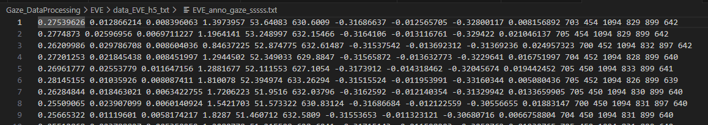
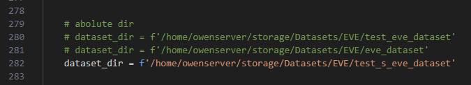
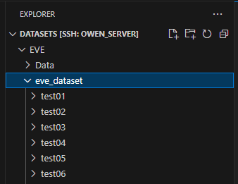

功能
---
用於轉換原始EVE的annotation當中h5格式轉換為txt的DataProcessing，後續可用於依據txt繪製plot的程式，請參考 violin_chart/EVE/data_plot_EVE.py




輸入參數
---
- -o output_txt_path (指定輸出的output txt 名稱)
  - EVE_anno_gaze_sssss.txt

執行cmd
---
```
python data_EVE_h5_txt.py -o EVE_anno_gaze_sssss.txt
```


原始dataset 路徑調整
---
依據EVE .h5 的擺放位置調整路徑  
  


資料夾檔案配置
---
data_EVE_h5_txt/  
└── data_EVE_h5_txt.py  
└── image/ (存放mark down 說明影像)  


