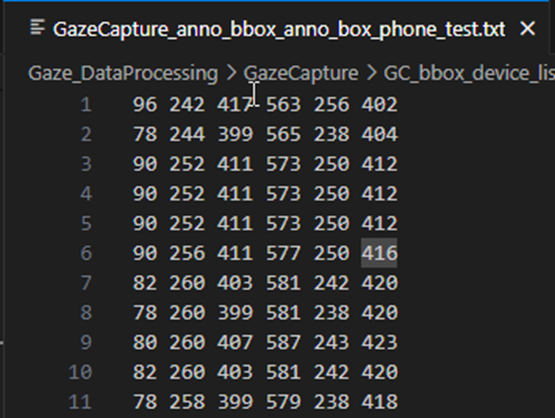
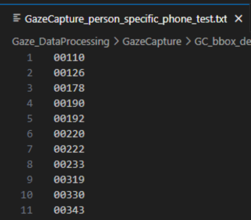

功能
---
用於生成兩個txt 
1. bbox在圖中的兩個座標位置與其中心位置，資料為影像當中的臉部bbox 位置 {x1} {y1} {x2} {y2} {center_x} {center_y}  
   
2. 指定的類別的person id list，用於配合計算faze preprocessing的GazeCapture 的gaze direciton / gaze orgin 數據  
create_hdf_files_for_faze_gc  
  


輸入參數
---
- -b output_anno_bbox_txt_path (設定輸出的bbox txt)
  - GazeCapture_anno_bbox_anno_box.txt
- -p output_person_specific_device_txt_path (peron list txt)
  - GazeCapture_person_specific.txt
- -d datatype (需要指定 train / test)
  - test
- -s s_device (指定 phone / tablet，如不輸入則是phone+tablet)
  - phone


輸出檔案名稱
---
會依據設定的 datatype / s_device 在輸出檔案的檔案名稱尾部加上對應的設定值
例如
- ### 輸入 
  - -b GazeCapture_anno_bbox_anno_box.txt
  - -p GazeCapture_person_specific.txt 
  - -d test 
  - -s phone
- ### 輸出
  -  GazeCapture_anno_bbox_anno_box_`test`_`phone`.txt
  -  GazeCapture_person_specific_`test`_`phone`.txt

```

```
執行cmd
---
```
python GC_bbox_device_list.py -b GazeCapture_anno_bbox_anno_box.txt -p GazeCapture_person_specific.txt -d test -s phone
```


資料夾檔案配置
---
GC_bbox_device_list/  
└── GC_bbox_device_list.py 


