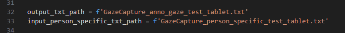
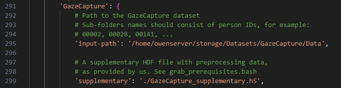

功能
---
用於計算GazeCapture的 normalized_gaze_direction  head_pose normalized_head_pose 等輸出，並且給予後續violin_chart/GazeCapture/.py 繪製dataset 的資料分布

需要透過GC_bbox_device_list 輸出對應的 GazeCapture_person_specific_DEVICE_DATATYPE  

該程式是由faze_preprocess 特化而來的，主要是因為 faze_preprocess 帶有計算normalization_matrix 的data normalization 操作，就可以提取出 normalized_gaze_direction normalized_head_pose  


faze_preprocess  
https://github.com/swook/faze_preprocess

輸入/輸出檔案名稱定義
---

- input
  - dataset (input-path)
  - supplementary
  - GazeCapture_person_specific_DEVICE_DATATYPE
- output
  - GazeCapture_person_specific_test_tablet

  




執行cmd
---
```
python create_hdf_files_for_faze_gc.py
```


資料夾檔案配置
---
create_hdf_files_for_faze_gc/  
└── image/ (存放mark down 說明影像)  
└── sfm_face_coordinates   
└── GazeCapture_supplementary.h5(faze_preprocess 提供的，需要另外下載)   
└── GazeCapture_person_specific_test_tablet.txt(指定需要的person lsit)   
└── GazeCapture_anno_gaze_test_tablet.txt(輸出的 Gaze數據)   
└── sfm_face_coordinates.npy(計算所需的臉部模型)   


