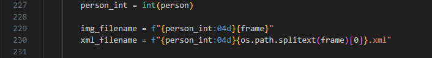
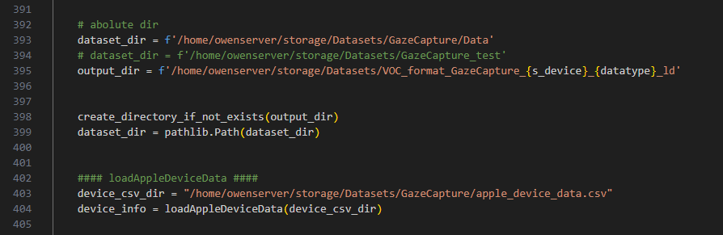
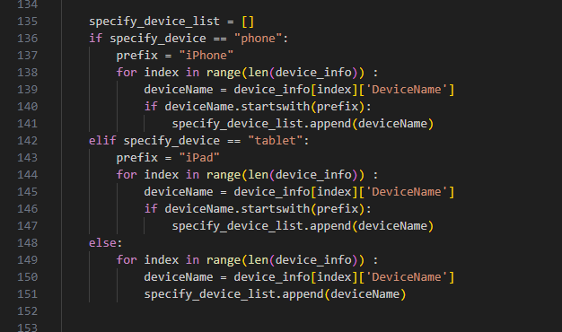

功能
---
用於將GazeCapture dataset 做第一階段的前處裡，由GazeCapture的json->voc，並且將特定需要用的annotation資料轉換為xml格式  
共有三個程式，voc2coco_GazeCapture(舊版)/ voc2coco_GazeCapture_face_ld(新版) / data2voc_GC_facecrop(影像臉部裁切版本) ，新版多放了更多標記數據，，舊版參考就好，以新版為主。  這邊以voc2coco_GazeCapture_face_ld 為主要講解對象


新的影像編號格式如下，依據/人物/影像來做編號，全部的標號不會重複  

<!--  -->


dataset input & output path
---
需要注意GazeCapture 除了dataset 之外，還需要引入DeviceData  



輸入參數
---
- -d datatype (指定train / test) 
  - 單獨指定
  - train 
- -s s_device (選擇device  phone tablet 如果不輸入，則為phone+tablet) 
  - 指定device
  - tablet


執行cmd
---
```
python data2voc_GC_face_ld.py -d test -s tablet
```


資料夾檔案配置
---
data2voc_GazeCapture/  
└── image/ (存放mark down 說明影像)  
└── data2voc_GC_face_ld.py  
└── data2voc_GC_facecrop.py   
└── data2voc_GC.py   


data2voc_GC_face_ld.py   
程式說明    
---
- [ImageProcessing_GazeCapture](data2voc_GC_face_ld.py#L131)  
依據指定的device把對應的標號加入到specify_device_list內  
  

- [ImageProcessing_Person](data2voc_GC_face_ld.py#L198)  
讀取json 檔案內容，把需要的data轉存變數  
  


- [Orientation](data2voc_GC_face_ld.py#L310)  
依據 Orientation 與對應的device width / height，然後計算注視點相對於相機與螢幕之間的距離，之後用於training vp offset 偏移
  


- [addGaze_ld_GazeCapture](data2voc_GC_face_ld.py#L362)  
將想要被寫入到xml格式下的資料放入到addGaze_GazeCapture_ld   
  


###  pascal voc writer  
- 透過F12 跳轉到voc writer，然後就可以看到 init 與 addGaze_ld_GazeCapture define
   
  


- template 是定義xml的格式輸出，可以自己做修改  
  - 如何找到template位置  
      
  - template的定義格式  
      


data2voc_GC_facecrop.py   
程式說明    
---
- [facecrop](data2voc_GC_facecrop.py#L362)  
CropImg_WithBlack 是用於把臉部位置切割出來的function， 然後可以再對其擴張 ex. 1.3，經過臉部裁切後，會以黑底+臉部存儲影像
  
