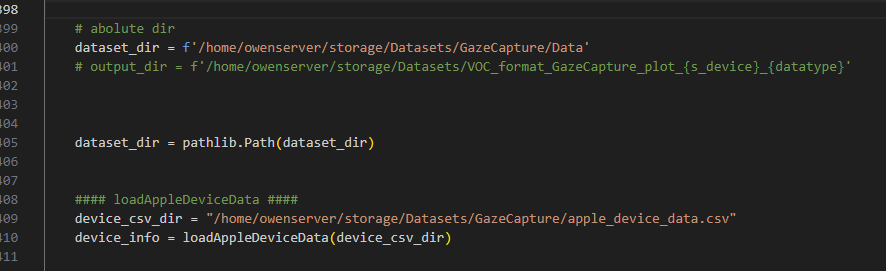

功能
---
可以顯示在virtual plane 上的 vp_gazepoint，用於觀察device 依據不同的orientation的gazepoint顯示位置。

vp_gazepoint


輸入參數
---
- -d datatype (train test)
  - train 
- -s s_device (tablet phone)
  - tablet 
- -o orientation (1 2 3 4)
  - 可以選擇想要輸出的方向
  - 1 


執行cmd
---
```
python data2voc_GC_gp_plot.py  -d train -s tablet -o 1

```


原始dataset 路徑調整
---
需要注意GazeCapture 除了dataset 之外，還需要引入DeviceData  



資料夾檔案配置
---
data2voc_GC_gp_plot/  
└── data2voc_GC_gp_plot.py  
└── image/ (存放mark down 說明影像)  


