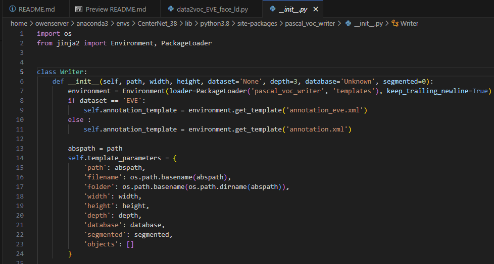
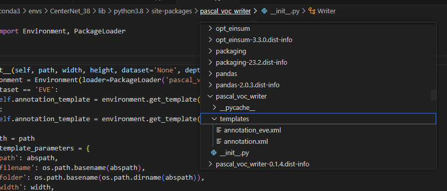

功能
---
用於將Himax dataset 做第一階段的前處裡，由Himax的txt->voc，並且將特定需要用的annotation資料轉換為xml格式    
共有兩個程式，data2voc_Himax(舊版)/ data2voc_Himax_face_ld(新版，帶有Gaze Origin / Target 可用於計算Gaze Direction誤差) ，新版多放了更多標記數據，舊版參考就好，以新版為主。  
data2voc_Himax_face_ld 為主要講解對象


dataset input & output path
---


輸入參數
---
- -d datatype (指定train / test) 
  - train or test  

- -s s_device (選擇device  monitor laptop 如果不輸入，則為monitor+laptop) 
  - 指定device
  - monitor
- -n no_image (選擇是否要輸出image) 
  - 主要是因為影像的編號與切分方式不會變動，但可能需要輸出新增或是修改的xml 就好，這時選擇不輸出影像，就可以加快xml輸出。  
  - true


執行cmd
---
```
python data2voc_Himax_face_ld.py -d train -s monitor  -n true
```


資料夾檔案配置
---
data2voc_EVE/  
└── image/ (存放mark down 說明影像)  
└── data2voc_Himax_face_ld.py  
└── data2voc_Himax.py   


程式說明
---
- [ImageProcessing_Himax] 
透過多個for loop 逐一訪問不同的datatype(spilt_sets) / person_folder，並且確認要使用的cameras_list，然後再依據指定的類型再做影像切分與對應的標記資料的轉換儲存  
並且還會對FD_bbox 做輸入，後續對於臉部bbox的data一同放入到.xml 內
  


- [gaze_origin / gaze_target]  
透過讀取annatation 的data，然後再轉換到分別的gaze_origin / gaze_target  
  


- [create pascal voc writer]
將上述的h5資料的變數，要被pascal voc writer作為輸入，這邊是對於writer 做初始化  
  


###  pascal voc writer  
- 透過F12 跳轉到voc writer，然後就可以看到 init 與 define
   
  


- template 是定義xml的格式輸出，可以自己做修改  
  - 如何找到template位置  
      
  - template的定義格式  
      


