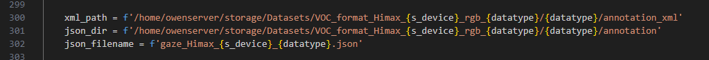
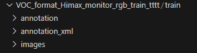
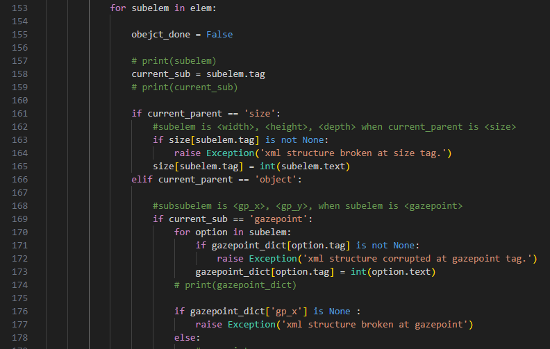
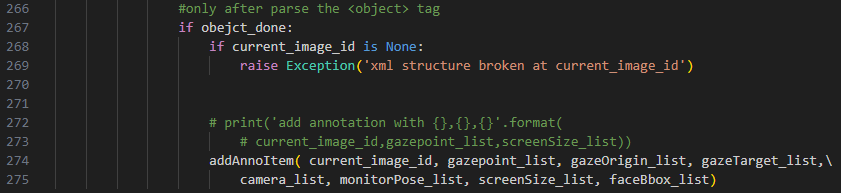

功能
---
用於將Himax dataset 做第二階段的前處裡，由Himax的voc->coco，會將EVE內train / test 的annotation_xml，單一資料夾內的全部.xml轉換為單一個.json格式  
共有兩個程式，voc2coco_Himax(舊版)/ voc2coco_Himax_face_ld(新版)，在第一階段如果是使用voc2coco_EVE_face_ld新版，那在第二階段就使用新版，以新版為主。  
影像的部分就不會再多處裡，第二階段主要是轉換的annotation xml -> json


dataset input & output path
---
需要注意指定的資料夾位置  



- annotation -> json (第二階段，新生成) 
- annotation_xml -> xml (第一階段)  
- images -> images (第一階段)   



輸入參數
---
- -d datatype (指定train / val) 
  - 需要單獨指定
  - train / val


執行cmd
---
```
python voc2coco_Himax_face_ld.py  -d train -s monitor
```


資料夾檔案配置
---
voc2coco_EVE/  
└── image/ (存放mark down 說明影像)  
└── voc2coco_Himax_face_ld.py  
└── voc2coco_Himax.py   


程式說明
---
- [parseXmlFiles_list_init]
建立不同資料所需要的變數dict 與 list  
  


- [parseXmlFiles_list_append] 
將對應的資料放入到list當中   
  


- [addAnnoItem] 
把所有的list，放入到coco list 當中，最後程式把該coco list 儲存為.json  
  
