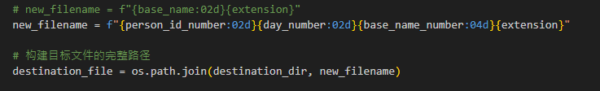
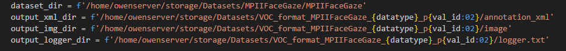
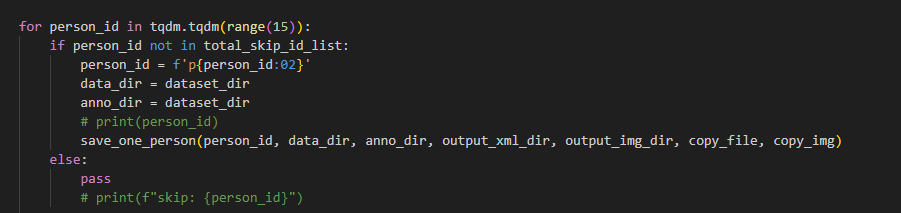
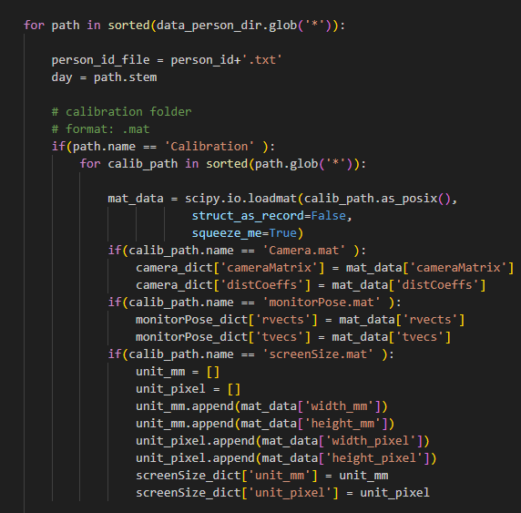
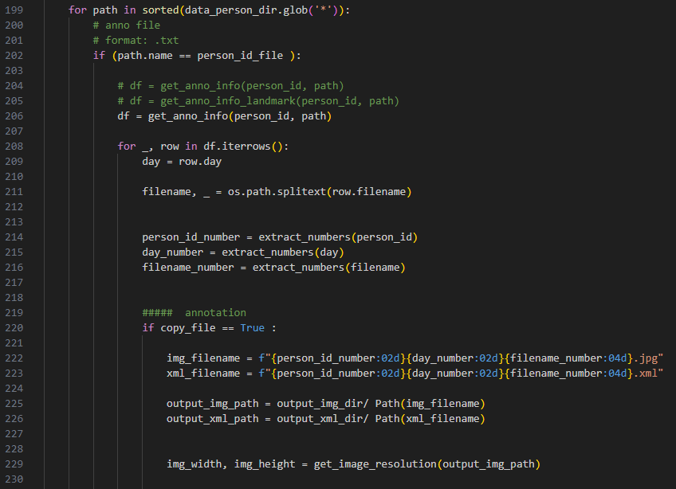
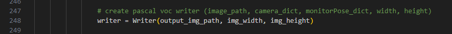
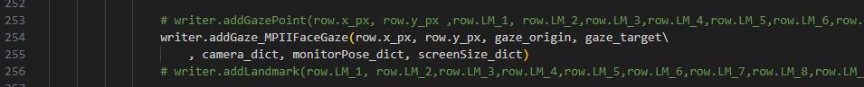
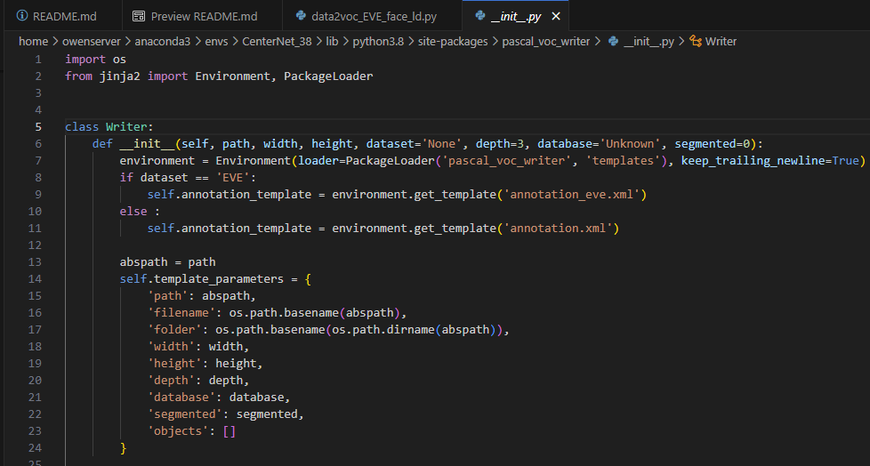

功能
---
用於將MPIIFaceGaze dataset 做第一階段的前處裡，由MPIIFaceGaze的txt->voc，並且將特定需要用的annotation資料轉換為xml格式    
MPIIFaceGaze 比較特別的是會需要以cross one cross out，將15個人->14個train / 1個val


新的影像編號格式如下，依據不同人物/天數/來做編號，全部的標號不會重複  



dataset input & output path
---



輸入參數
---
- -d datatype (指定train / test) 
  - train or test 
- -v val_id (指定val) 
  - 用於選定被挑出來的val編號  0~14
  - 1


執行cmd
---
```
python data2voc_MPIIFaceGaze.py -d test -v 1
```
train
當選擇val 1 的時候，就會是除了1之外的編號都會將image/ annotation_xml 轉換至train 資料夾之下

test
當選擇val 1 的時候，只會對編號1將image/ annotation_xml test 資料夾之下


資料夾檔案配置
---
data2voc_MPIIFaceGaze/  
└── image/ (存放mark down 說明影像)   
└── data2voc_MPIIFaceGaze.py   


程式說明
---
- [person_id](data2voc_MPIIFaceGaze.py#L348)  
依據不同的person_id依序執行單個編號人物的資料處理，涉及到folder的access   
  

- [read calibration](data2voc_MPIIFaceGaze.py#L167)  
讀取calibration 內的.mat 資料，然後存放於特定的變數內   
  

- [read txt](data2voc_MPIIFaceGaze.py#L199)  
讀取data_person_dir 內的.txt 資料 
  

- [create pascal voc writer](data2voc_MPIIFaceGaze.py#L248)  
將上述的txt + mat資料的變數，要被pascal voc writer作為輸入，這邊是對於writer 做初始化  
  

- [addGaze_MPIIFaceGaze](data2voc_MPIIFaceGaze.py#L362)  
將想要被寫入到xml格式下的資料放入到addGaze_MPIIFaceGaze   
  


###  pascal voc writer  
- 透過F12 跳轉到voc writer，然後就可以看到 init 與 addGaze_ld_MPIIFaceGaze define
   
  


- template 是定義xml的格式輸出，可以自己做修改  
  - 如何找到template位置  
      
  - template的定義格式  
      

