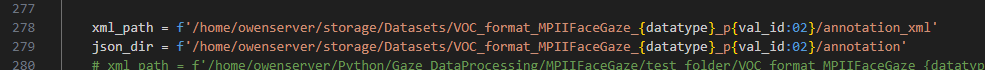
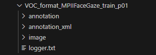
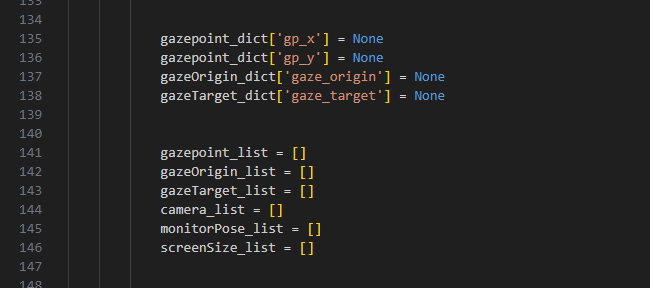
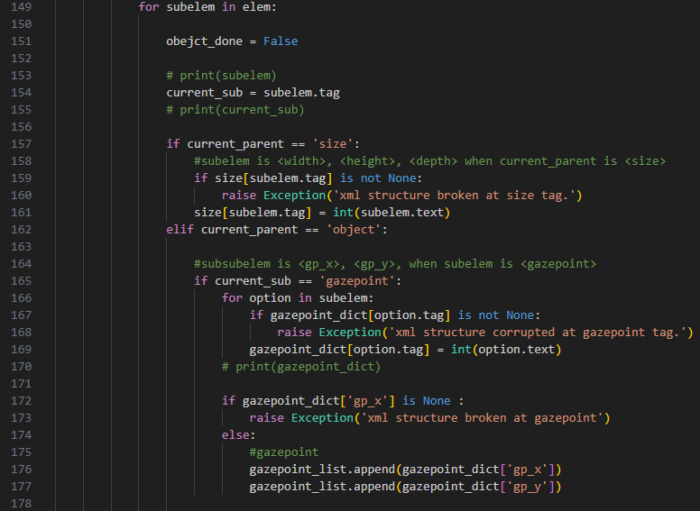
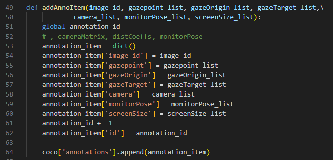

功能
---
用於將MPIIFaceGaze dataset 做第二階段的前處裡，由MPIIFaceGaze的voc->coco，會將MPIIFaceGaze內train / val / test 的annotation_xml，單一資料夾內的全部.xml轉換為單一個.json格式  
 
影像的部分就不會再多處裡，第二階段主要是轉換的annotation xml -> json


dataset input & output path
---
需要注意指定的資料夾位置  


- annotation -> json (第二階段，新生成) 
- annotation_xml -> xml (第一階段)  
- images -> images (第一階段)   



輸入參數
---
- -d datatype (指定train / val) 
  - 需要單獨指定
  - train / val
- -v val_id (指定val) 
  - 用於選定被挑出來的val編號  0~14
  - 1


執行cmd
---
```
python voc2coco_MPIIFaceGaze_face_ld.py -d train -v 1
```


資料夾檔案配置
---
voc2coco_MPIIFaceGaze/  
└── image/ (存放mark down 說明影像)  
└── voc2coco_MPIIFaceGaze.py   


程式說明
---
- [parseXmlFiles_list_init](voc2coco_MPIIFaceGaze.py#L135)  
建立不同資料所需要的變數dict 與 list  
  


- [parseXmlFiles_list_append](data2voc_MPIIFaceGaze.py#L149)  
將對應的資料放入到list當中   
  


- [addAnnoItem](data2voc_MPIIFaceGaze.py#L257)  
把所有的list，放入到coco list 當中，最後程式把該coco list 儲存為.json   
  
