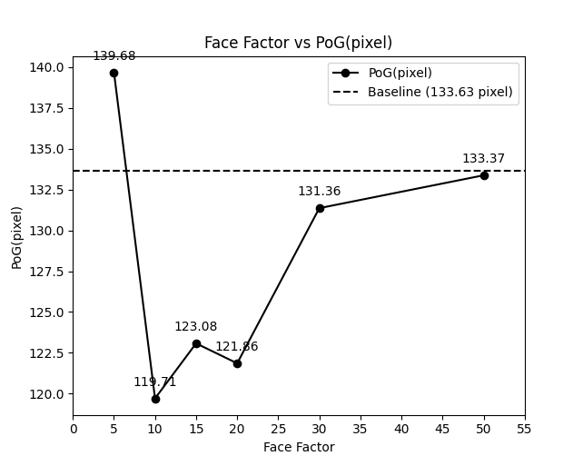
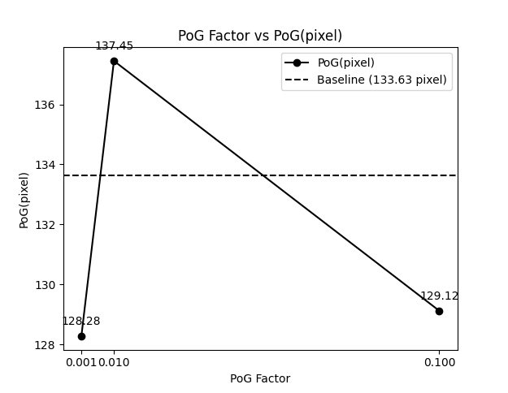
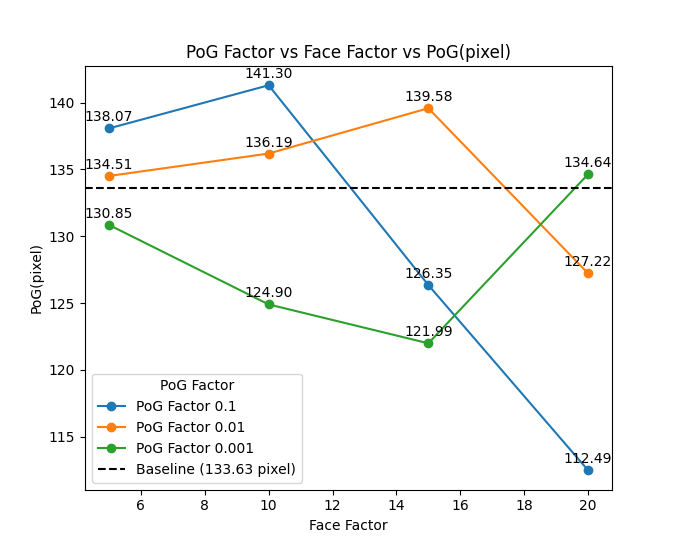
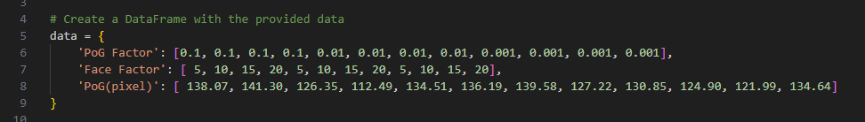

功能
---
用於繪製折線圖，分別有單數據折線(line_chart)，與多數據折線(multi_line_chart)







input data  
---
- line_chart  
  -   
- multi_line_chart   
  -   


執行cmd
---
```
python line_chart.py  
python multi_line_chart.py
```


python line_chart.py
---
可以在程式內將對應的Face / PoG 的資料與顯現格式切換
PoG  的x軸會是log scale
Face 的x軸是正常的比例


資料夾檔案配置
---
line_chart/    
└── line_chart.py  
└── multi_line_chart.py  
└── image/ (存放mark down 說明影像)  

└ ─ │

