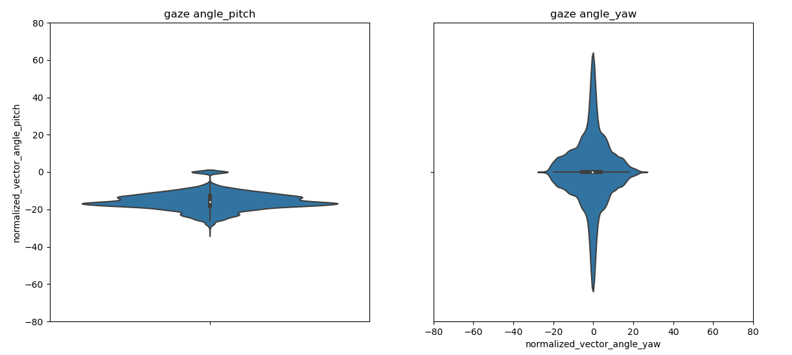
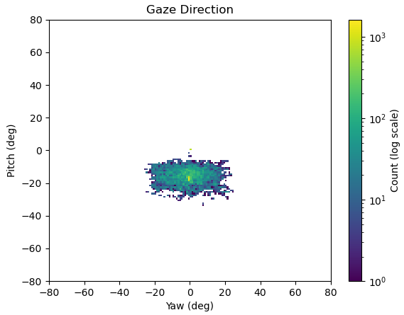

功能
---
用於繪製dataset的violin plot / heatmap，其中，並且可選擇需要的 txt 檔案  
(該資料來自於原始EVE的annotation，但需要另外經過h5轉換為txt的DataProcessing，請參考 Gaze_DataProcessing/EVE/data_EVE_h5_txt/data_EVE_h5_txt.py)  
(該程式只是依據txt繪製plot)

  
  


輸入參數
---
- -p datadir (指定的data list)
  - EVE_anno_gaze.txt

執行cmd
---
```
python data_plot_EVE.py -p EVE_anno_gaze_s.txt
```


資料夾檔案配置
---
EVE/  
└── EVE_data/  
│ └── EVE_anno_gaze_s.txt (小型測試用)  
│ └── EVE_anno_gaze.txt  
└── image/ (存放mark down 說明影像)  


