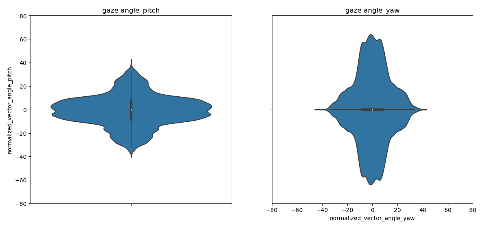
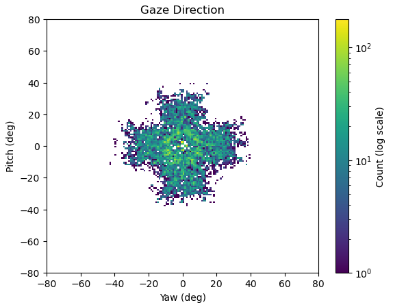
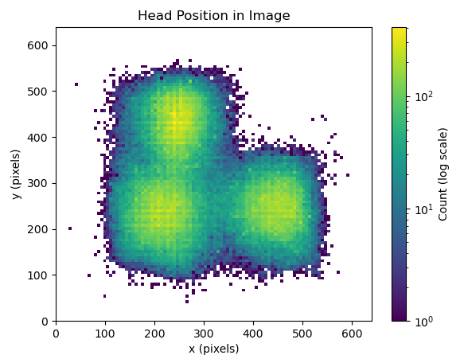
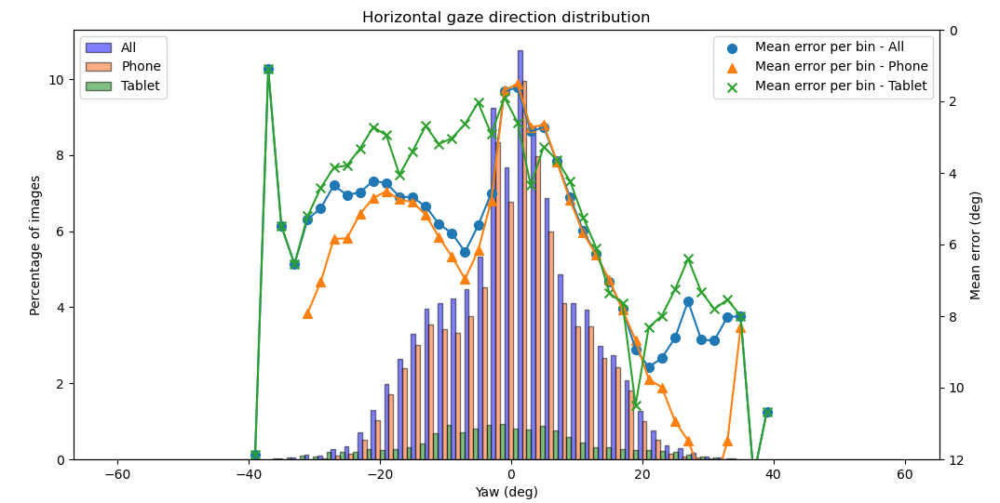
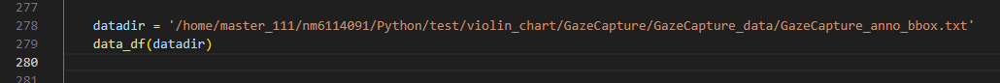
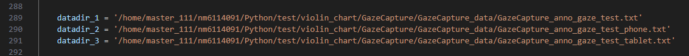

功能
---
用於繪製dataset的violin plot / heatmap，其中，並且可選擇需要的 txt 檔案，都包含gaze direction 與 head pose 兩種不同的data type 輸出  
txt 檔案都來自於 create_hdf_files_for_faze_gc(無模型輸出gt vs predict error) /  GazeCaptrue_model_angle_error((有模型輸出gt vs predict error)) 的前處裡
1. 繪製 dataset distribution  
     
     
2. 繪製 face position in image  
     
3. 繪製 dataset distribution vs model error  
      


輸入參數
---
1. 繪製 dataset distribution
- -p datadir (指定的data list)
  - GazeCapture_anno_gaze_test_tablet.txt

2. 繪製 face position in image  
    
  
3. 繪製 dataset distribution vs model error，因為會同時比較多組的輸出，所以需要自行調整1/2/3 的data path，例如這邊就是比較了all/phone/tablet 三組data於同一圖表
    


執行cmd
---
1. 繪製 dataset distribution
```
python data_plot_GC.py -p GazeCapture_anno_gaze_test_tablet.txt
```

2. 繪製 face position in image 
```
python data_plot_GC_bbox_center.py
```

3. 繪製 dataset distribution vs model error
```
python data_plot_GC_mix_error.py 
```


資料夾檔案配置
---
EVE/  
└── EVE_data/  
│ └── EVE_anno_gaze_s.txt (小型測試用)  
│ └── EVE_anno_gaze.txt  
└── image/ (存放mark down 說明影像)  


