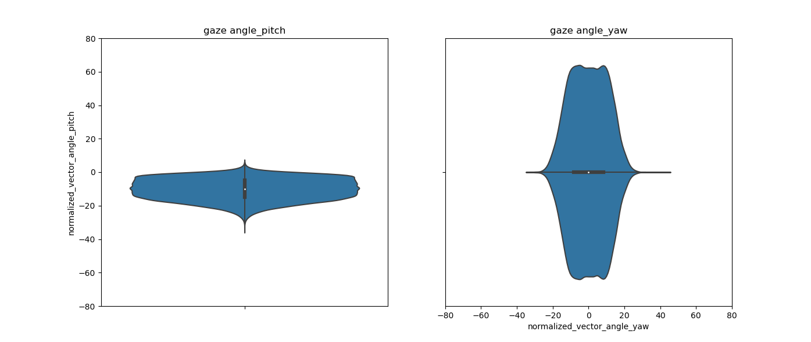

功能
---
用於繪製dataset的violin plot / heatmap，其中，並且可選擇需要的 txt 檔案
(需要使用另外的程式處理，該程式只是依據txt繪製plot)

(此版本與MPIIFaceGaze_dataset_original版本差異在於，MPIIFaceGaze_dataset_original 是以原始 MPIIFaceGaze dataset 所提供的annotation 為基準，然後此版本是以另外faze preprocessing 計算 gaze orgin 然後再以該model 計算的gaze angle error 計算得到的txt數據)


  
  


輸入參數
---
- -p datadir (指定的person列表)
  - MPIIFaceGaze_anno_gaze_all.txt

執行cmd
---
```
python data_plot_MPIIFaceGaze.py -p MPIIFaceGaze_anno_gaze_all.txt
```


資料夾檔案配置
---
MPIIFaceGaze/  
└── MPIIFaceGaze_data/  
│ └── MPIIFaceGaze_anno_gaze_s.txt (小型測試用)  
│ └── MPIIFaceGaze_anno_gaze_all.txt  
└── image/ (存放mark down 說明影像)  


