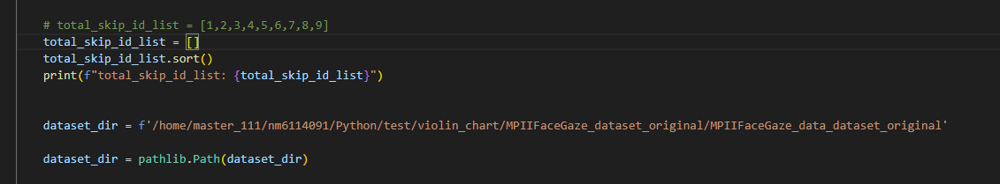

功能
---
用於繪製dataset的violin plot / heatmap，其中，並且可選擇需要的 txt 檔案

(此版本與MPIIFaceGaze版本差異在於 針對的資料為原始 MPIIFaceGaze dataset 所提供的annotation 為基準，該annotation 並沒有提供gaze orgin，所以僅能計算2D PoG error，無法計算對應的3D gaze angle error

如果想要計算gaze origin，需要另外參考MPIIFaceGaze版本，該版本基於faze preprocessing 計算 gaze orgin(需要使用另外的程式處理，該程式只是依據txt繪製plot)，所以有3D gaze angle error 繪製)


設定參數
---



total_skip_id_list可以設定不想要被參與的person， 例如

```
total_skip_id_list = [1,2,3,4,5,6,7,8,9]
```
這樣1,2,3,4,5,6,7,8,9就被排除統計


dataset_dir直接取得MPIIFaceGaze的annoation data path

執行cmd
---

```
python data_plot_MPIIFaceGaze_dataset_original.py 
```

資料夾檔案配置
---

MPIIFaceGaze/  
└── MPIIFaceGaze_data_dataset_original/  
│ └── p00~p14  
└── image/ (存放mark down 說明影像) 


