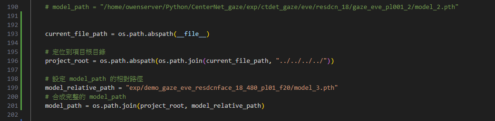

# Demo

有demo 影片 20240417_Demo_EVE_640x360.mkv

1. Activate webcam rule
   * cd /dev
   * sudo chmod 777 video0
2. Activate Conda environment
   * conda activate CenterNet_38
3. To execute runeval.sh in CenterNet_gaze/runeval.sh, please note the following:
   * Ensure that the demo model path you are using is placed in the directory:
     * Path: CenterNet_gaze/exp/demo_gaze_eve_resdcnface_18_480_pl01_f20.
   * Pay attention to line 199 in live.py, where the specific model path needs to be set.
     * 
     * 我們要執行在CenterNet_gaze/runeval.sh 的 runeval.sh
       需要注意 你的所使用的demo model path 放在 /home/owenserver/Python/CenterNet_gaze/exp/demo_gaze_eve_resdcnface_18_480_pl01_f20 資料夾當中
     * 但因為檔案太大，所以有兩個路徑可以取得
       * AIS NAS /Data-Weight/Gaze/EVG/model_weight
       * Google drive https://drive.google.com/drive/folders/13V5U59pxl_0_lzcpDcrmUBuk_IHUIQWK?usp=sharing
     * 然後需要注意live.py line 199 是為指定的model path
4. run    bash runeval.sh
   * CenterNet_gaze/runeval.sh
   * 執行 bash runeval.sh
