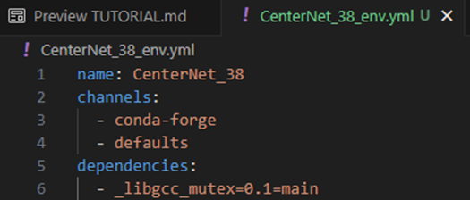
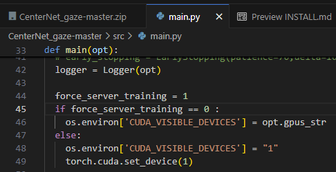

# Installation


The code was tested on Ubuntu 20.04, with [Anaconda](https://www.anaconda.com/download) Python 3.8 and [PyTorch]((http://pytorch.org/))
After install Anaconda:

1. Clone this repo:

    ~~~
    git clone https://github.com/owen1994-tw/CenterNet_gaze.git
    ~~~
    or  
    ~~~
    unzip CenterNet_gaze-master.zip
    ~~~

2.  Import conda enviroment and pip install packages:  
    Prepare the CenterNet_38_env.yml file, where you can modify the desired environment name within the yml.  
    

    ~~~
    conda env create -f CenterNet_38_env.yml
    ~~~
    And activate the environment.
    ~~~
    pip install torch==1.12.0+cu113 torchvision==0.13.0+cu113 torchaudio==0.12.0 --extra-index-url https://download.pytorch.org/whl/cu113
    ~~~

    ~~~
    pip install -r requirements.txt
    ~~~
     
3. Install [COCOAPI](https://github.com/cocodataset/cocoapi):

    ~~~
    # COCOAPI=/path/to/clone/cocoapi
    git clone https://github.com/cocodataset/cocoapi.git $COCOAPI
    cd $COCOAPI/PythonAPI
    make
    python setup.py install --user
    ~~~


4. Build DCNv2:  

    ~~~
    /src/lib/models/networks/DCNv2
    python3 setup.py build develop
    ~~~

5. Test:  
    Build data short cut link for EVE dataset  
    ~~~
    ln -s /storage/share/Gaze/gaze_EVE_ffmpeg_ld /home/master_113/nm6134067/CenterNet_gaze-master/data/gaze_EVE_ffmpeg_ld
    ~~~

    Training cmd

    [Optional]
    change training GPU id to 1  in main.py  
    
    ```
    force_server_training = 0 -> force_server_training = 1
    ```  
    
    ~~~
    cd /src  
    
    python main.py ctdet_gaze --exp_id gaze_eve_480_pl01_1_test --arch resdcn_18 --dataset eve --num_epochs 20 --batch_size 64 --vp_h 2160 --vp_w 3840 --vp_pixel_per_mm 3.3 --keep_res --resize_raw_image --resize_raw_image_h 270 --resize_raw_image_w 480 --camera_screen_pos --pog_offset --pog_weight 0.1
    ~~~

### Refference
If you encounter any issues during installation, you can refer to the CenterNet installation steps, as the project is based on modifications of CenterNet

- CenterNet official installation
  - https://github.com/xingyizhou/CenterNet/blob/master/readme/INSTALL.md
- Bilibili tutorial Video
  - https://www.bilibili.com/video/BV1eM4y1o7Xe/?p=2&vd_source=7ceeb6dda3d4cee075e74b143d53677e
