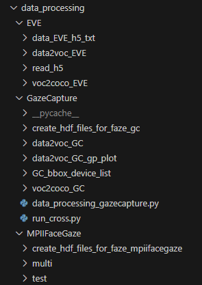

# Dataset preparation

## Data Processing  

- 因應我們的code是以CenterNet 為基礎來開發的方法，所以在訓練方面會需要依循特定的資料/標記流程，因此對於數據集會需要經過前處理轉換後，才能被訓練，是以cocoapi 為依據
- 流程與產出的Folder關係 
  - 不同的原始Dataset(MPIIFaceGaze / EVE / GazeCapture / Himax ) 
  - (第一階段output) VOC_format_XXXX
    - 這階段的格式會需要依據不同的Dataset 標註資料與方式做客製化的調整
    - Train / Val / Test
      - annotation_xml(per frame with new image number)
      - images(per frame with new image number)
  - (第二階段) gaze_XXXX
    - 這階段主要是要把每張照片的annotation_xml(xml) 整合轉換為單一個annotation(json)
    - Train / Val / Test
       - annotations(轉換annotation_xml為單一.json)
  - (第三階段) gaze_XXXX
      - 需要自己建立gaze_XXXX資料夾，把annotation / images 放進來，用於model training / validation 使用  

### Preprocessing Code

程式的說明與操作都在個別的folder內的README.md  

#### EVE
- read_h5
  - 用於測試輸出.h5內的資料

- data_EVE_h5_txt
  - 用於轉換原始EVE的annotation當中h5格式轉換為txt的DataProcessing，後續可用於依據txt繪製plot的程式

- data2voc_EVE
  - 用於將EVE dataset 做第一階段的前處裡，由EVE的h5->voc，會將EVE 的影像mp4 透過ffmpeg 分割為指定Hz 數量，ex 30Hz -> 30張，並且將特定需要用的annotation資料轉換為xml格式  

- voc2coco_EVE
  - 用於將EVE dataset 做第二階段的前處裡，由EVE的voc->coco，會將EVE內train / val / test 的annotation_xml，單一資料夾內annotation全部.xml轉換為單一個.json格式  

#### MPIIFaceGaze
- run_data2voc / run_voc2coco
  - 為了要對於MPIIFaceGaze 需要做cross one out 的train / test，總共就會需要做15種組合，也因此這邊提供可以一次執行多次，並起可設定參數的指令的多次持行程式  

- data2voc_MPIIFaceGaze
  - 用於將MPIIFaceGaze dataset 做第一階段的前處裡，由MPIIFaceGaze的txt->voc，並且將特定需要用的annotation資料轉換為xml格式    
  - MPIIFaceGaze 比較特別的是會需要以cross one cross out，將15個人->14個train / 1個val

- voc2coco_MPIIFaceGaze
  - 用於將MPIIFaceGaze dataset 做第二階段的前處裡，由MPIIFaceGaze的voc->coco，會將MPIIFaceGaze內train / val / test 的annotation_xml，單一資料夾內的全部.xml轉換為單一個.json格式  
- create_hdf_files_for_faze_mpiifacegaze
  - 用於計算MPIIFaceGaze的 normalized_gaze_direction  head_pose normalized_head_pose 等輸出，並且給予後續violin_chart/EVE/data_plot_MPIIFaceGaze.py 繪製dataset 的資料分布  

#### GazeCapture

- data2voc_GC_gp_plot
  - 可以顯示在virtual plane 上的 vp_gazepoint，用於觀察device 依據不同的orientation的gazepoint顯示位置。

- data2voc_GC
  - 用於將GazeCapture dataset 做第一階段的前處裡，由GazeCapture的json->voc，並且將特定需要用的annotation資料轉換為xml格式  

- voc2coco_GC
  - 用於將GazeCapture dataset 做第二階段的前處裡，由GazeCapture的voc->coco，會將GazeCapture內train / test 的annotation_xml，單一資料夾內的全部.xml轉換為單一個.json格式  

- create_hdf_files_for_faze_gc
  - 用於計算GazeCapture的 normalized_gaze_direction  head_pose normalized_head_pose 等輸出，並且給予後續violin_chart/GazeCapture/.py 繪製dataset 的資料分布

- GC_bbox_device_list  
用於生成兩個txt 
  1. bbox在圖中的兩個座標位置與其中心位置，資料為影像當中的臉部bbox 位置 {x1} {y1} {x2} {y2} {center_x} {center_y}  
  2. 指定的類別的person id list，用於配合計算faze preprocessing的GazeCapture 的gaze direciton / gaze orgin 數據  

## Plot data
Due to GitHub's data limitations, I have placed the data for plotting dataset distribution on AISLab-NAS  
[Plot data](https://aislabnas.ee.ncku.edu.tw/sharing/XwKB0XgZL)

~~~
/Data-Weight/Gaze/EVG/plot_data/  
└── violin_chart/  
    └── EVE_data
    └── GazeCapture_data
    └── MPIIFaceGaze_data
    └── MPIIFaceGaze_dataset_original
~~~

