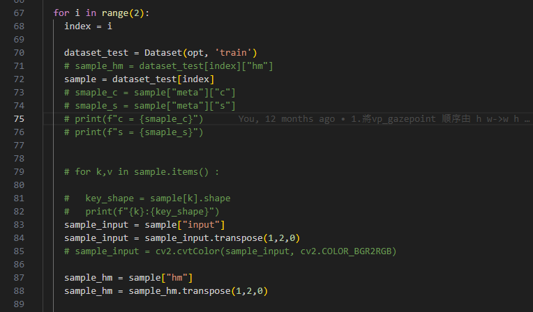
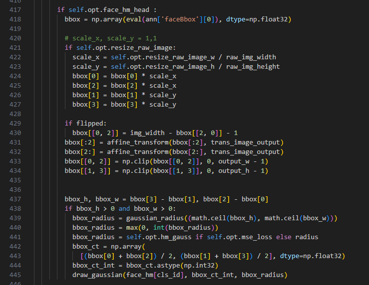
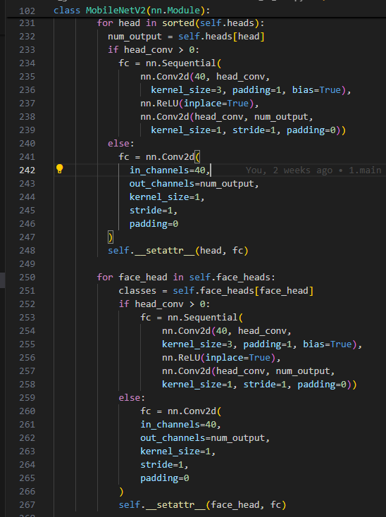

# EVG : Efficient End-to-End Virtual Plane Gaze Estimation

## Main
基礎的model create / training / val / save weight 等操作 

### Path
`/home/owenserver/Python/CenterNet_gaze/src/main.py`

### 輸出單張影像觀察 cv2 相關
為了可以在訓練前確認要被訓練的影像實際狀況是甚麼，可以在 `main` 的部分把影像輸出觀察，被處理的影像大都會是在 `/home/owenserver/Python/CenterNet_gaze/src/lib/datasets/sample/ctdet_gaze.py` 做處理，例如大小/顏色 normalize 等等  
可以調整for loop range 當中的數字，該數字是指要顯示input image的數量，sample變數當中帶有  
- sample["input"]，其代表調整後的input image  
- sample["hm"]，代表轉換過夠的vitual plane 帶有 heatmap PoG  
- sample["face_hm"]，代表轉換過夠的input image 的 face center heatmap   
  

### Early Stop
對於訓練方面，dataset 有大有小，而我們會希望 early stop 讓已經訓練方向變差的模型早點結束訓練  
default 參數是 4 次 delta 10 ，功能是當前的數據與最好的數據比較後，當差距大於10的時候，就會計數1次，當小於等於10的時候，則不計數，而達到設定次數4次後，就會停止訓練  
  

### 儲存 val_intervals 數量 (val)
可以設定要經過幾次 epoch 訓練後，做 val 觀察訓練準確度，並且把該次的 train weight 儲存下來 ， val_intervals 的設定可以在 opt `/home/owenserver/Python/CenterNet_gaze/src/lib/opts.py` 訓練參數設定  
  
  

### 指定 gpu (3090_178)
在部分的實驗室 server 是有雙 GPU 的配置，而可能我們被分配到的 GPU index = 1，那就會需要指定 GPU 的設定，設定 force_server_training 的指定gpu index  
  

## Sample

Sample 是主要核心的部分，將 original image 轉換為設定大小與 point of gaze on screen plane 轉換為 point of gaze on virtual plane 的步驟，並且也會把其中的 transform 等等保留下來，用於後續 inverse transform 所需要的重要參數，保留於 ret 當中

### Path
`/home/owenserver/Python/CenterNet_gaze/src/lib/datasets/sample/ctdet_gaze.py`

### __getitem__
- ann['xxxx'] 這是來自於annotation.json的標記data ，例如 ann["screenSize"] / ann['gazepoint'] / ann['faceBbox']....  
- opt 是外部cmd輸入參數，可以在`/home/owenserver/Python/CenterNet_gaze/src/lib/opts.py` 找到default，當然也可以在輸入cmd的時候設定需要的參數值  
- 流程:  
  讀取img -> (face_crop)-> color normalize -> get_affine_transform of (inp / R )  with trans_image_output -> gazepoint to virtual plane -> gaussian_kernel to heatmap virtual plane

- return value:  
    

### face_crop_ratio (opt.face_crop_ratio)
如果會須要對於人臉影像做切割的話，就會需要把設定face_crop_ratio > 0 ，來讓input image 做臉部的裁切，並把非臉部區域已平均顏色做masking，而當中的臉部bbox則是由annotation.json 當中的 faceBbox 提供數值  
    

### get_affine_transform
需要注意的部分是，因為我們除了把原影像的大小透過 cv2.warpAffine 做resize 變化大小之外，我們還要在inverse 回到原尺寸，並且重點是要轉換在vitural plane 的PoG 的點，所以使用一般的resize 並不能達到點的轉換，也所以說會需要以 get_affine_transform 的到transform matrix，並且在low resoluition 要回到原尺寸時以 inverse transform matrix 做 affine transform 轉換  
  

### Virtual Plane with PoG (gazepoint)
**1. gazepoint 轉換**  
透過ann['gazepoint'] 取得注視點，然後再依據 standardize ppm 來調整不同resolution之下的位置  
  

依據不同的dataset，計算不同的相機與螢幕之間的offset 位移  
  

把原本是以screen 為平面的gazepoint 轉換到以virtual plane為平面上去  
這邊因為可能是標註問題，所以可以會發現有超出virtual plane 的gazepoint，而我們就會把這些點拉限制於virtual plane 翻圍內  
  

**2. gaussian_kernel**   
依據ct_int(vp_gazepoint_output)，配合指定的radius做 heatmap virtual plane 產生， hm  
  

face_hm_branch 的部分也差不多，但是是改為bbox_ct_int，配合指定的radius做 heatmap virtual plane 產生， face_hm  
  

### Ret
會把後需相關需要的data都放到 ret 參數內  
  

## Model  
用於建立與載入pretrained model 與weight 的操作過程
### Path  
`/home/owenserver/Python/CenterNet_gaze/src/lib/models/model.py`  

在main.py 當中會看到create_model，這個funcition 用於建立，在cmd 當中選定的model  
`--arch resdcn_18`   
`--arch hourglass`  
`--arch dla_34`  
  
會透過 cmd 的參數選擇特定的model， 例如 resdcn_18 / dla_34 ，其中也會對應的指定的層數版本  
  

### 新增
在方法當中介紹過，我們的模型是依據encoder decoder 架構所建立，所以對於encoder的部分是以經典的模型為主，例如resnet18 / mobilenetV2 等等，然後在decoder 的部分就會補上decoder的部分，讓經過encoder 縮小的feature map 再度經過三組的deconvolution 做放大的操作，所以當需要新增自定義的經典模型的話，會需要自行定義需要的deconvolution層數，這部分也會攸關到模型的大小變化，下面會以 resnet18 / mobv2 做範例說明，上述的backbone 挑選都是依據有pytorch 官方 提供經過ImageNet所訓練後的weight 為使用基準，因為經過測試若直接以inital weight 訓練，效果很差

https://pytorch.org/vision/stable/models.html
  

## Networks  
建立model的核心部分，會選定指定的network，並且可自行調整network的架構，例如 deconvolution 部分的channel 數量設定
### <u>resnet_dcn</u>
### Path
`/home/owenserver/Python/CenterNet_gaze/src/lib/models/networks/resnet_dcn.py`  

這部分可以由 model.py 當中的 create_model function 內的 get_model 再轉換到這邊  
PoseResNet(block_class, layers, heads, head_conv=head_conv) 當中的 layers 就會對應到 18 layers，heads是對應到heatmap(1) 與 offset(2 -> x, y )，head_conv 是對應到內部的channel 數量變化  
   

在PoseResNet當中定義各layer的層數，並且主要注意的是deconv_layers 就是前面提到的decoder 部分會要放大的deconvolution設定，也是這個部分可以調整deconvolution 的channel(depth)，resnet18 的版本設定是依據centerNet 的數量，沒有做變動。  
  
  

可以從forward觀察到，在經過resnet架構之後，就會執行 deconv_layers，然後依據head 數量，輸出對應的feature map  
  

---
### <u>resnet_dcn_face</u>  
### Path  
`/home/owenserver/Python/CenterNet_gaze/src/lib/models/networks/resnet_dcn_face.py`   

face 的版本差異在於heads 部分，增加了face_head的處理  
  

---
### <u>mobv2</u>  
### Path
`/home/owenserver/Python/CenterNet_gaze/src/lib/models/networks/mob_v2.py`    
mobv2 與上述的resnet18 類似，都是會經過get_pose_net再進入到model，因為mobilenet_v2 不可以選定layer，所以就不採用num_layers參數，並且可以看到我們會透過
model_urls 來取得pretrained weight  
  
我們可以在self.deconv_layers 設定有關deconvolution設定  
  

---
### <u>mobv2_face</u>  
### Path
`/home/owenserver/Python/CenterNet_gaze/src/lib/models/networks/mob_v2_face.py`   

face 的版本差異在於heads 部分，增加了face_head的處理   
  

---
### <u>model_arch_output (計算 model 大小)</u>  

### Path
`/home/owenserver/Python/CenterNet_gaze/src/lib/models/model_arch_output.py`  

對於要計算model flops parameter 時，我們是透過calflops計算的，當然也可以替換為其他的package  

透過選擇使用對應的networks，然後使用對應的parameter來建立model  
  
  

需要注意的部分是，因為我們的模型會經過前處理把影像做為微調整，會將大小做padding，所以輸入大小與輸入到model 的大小會有所調整  

pading to 32 times (padding black babckground) -> model size   
(640, 360) -> 672, 384  
(480, 272) -> 512, 288   
  

## Loss  
說明個別loss的計算過程與total loss 的加總
### <u>ctdet_gaze</u>    
### Path
`/home/owenserver/Python/CenterNet_gaze/src/lib/trains/ctdet_gaze.py`

我們這邊定義了hm_loss (heatmap loss) + off_loss( offset loss)  
  

pog_loss 會需要先把 hm + offset 計算回到原尺寸後，才可以在與ground truth 做計算  
  
  

### total loss  
loss = opt.hm_weight * hm_loss + opt.off_weight * off_loss + opt.pog_weight * pog_loss + 1 *regular_loss 
  

---
### <u>ctdet_gaze_face</u>    

### Path
`/home/owenserver/Python/CenterNet_gaze/src/lib/trains/ctdet_gazeface.py`  

差異在於多補了計算face 的部分  
  

  
## Dataset  
Dataset的路徑/mean /std 等等 設定  
- mpiifacegaze  
  

- eve  
  

- gazecapture  
  

### Path  
`/home/owenserver/Python/CenterNet_gaze/src/lib/datasets/dataset/mpiifacegaze.py`  

### 建立捷徑/路徑 link ln (dataset)  
需要建立相對應的datast連結，model 才可以取得影像與anntation  
    

可以透過linux cmd 建立路徑  
   

`ln -s  /home/owenserver/storage/Datasets/gaze_EVE  /home/owenserver/Python/CenterNet_gaze/src/tools/mpiifacegaze_eval/mpiifacegaze_eval_lib/data/gaze_EVE`

### 修改 training/val path  & mean/std

可以修改在前處理時，會對影響做的mean std 的顏色調整用的參數  
並且會需要把對應的data folder 資料夾名稱做適當的對應修改，例如mpiifacegaze 所示的，folder 的名稱就是定義為gaze_MPIIFaceGaze ， 然後在folder 底下再分別建立images 與 annotation，並且依據 train / val 來指派不同datatype 的annotation 做不同階段(train / val)使用  
  

## Opt  
許多cmd 的參數default 都可以在opt 內找到，並且如果需要新增自定義的話，也是可在這邊新增  

### Path 
`/home/owenserver/Python/CenterNet_gaze/src/lib/opts.py`  

##  Cmd (pog + face version)  
Training cmd  
cmd 的組成主要有幾點
- ctdet_gaze / ctdet_gaze_face
  - 使用 有/無 face 的版本
- --exp_id gaze_resdcn18_ep70_all_csp_kr_resize_p11_test 
  - 儲存的id
- --arch resdcn_18
  - 使用的model 
- --dataset mpiifacegaze 
  - train/val 的 dataset
- --num_epochs 70 --lr_step 45,60  
  - 訓練epoch次數 / 下降10倍 learning rate 的epoch 次數
- --keep_res  
  - 如果沒有使用keep_res input image 會以 長/寬最大邊，作為tranform 的影像轉換(會以方形作為轉換)  
  
- --resize_raw_image_h 270 --resize_raw_image_w 480 
- --camera_screen_pos 
  - 螢幕與相機是否相對位移 offset_x / offset_y
- --vp_h 2100 --vp_w 3360 
  - 定義virtual plane 的大小
- --vp_pixel_per_mm 5 
  - 標準化不同螢幕平面的單位ppm
- --pog_offset --pog_weight 0.1
  - 設定pog_offset 與 權重
- --face_hm_head --face_hm_weight 5
  - 設定face_hm_head  與 權重

- mpiimfacegaze  
  - --data_train_person_id 11 --data_test_person_id 11  
    - 指定哪個person 是被選定val
  - `main.py ctdet_gaze --exp_id gaze_resdcn18_ep70_all_csp_kr_resize_p11_test --arch resdcn_18 --dataset mpiifacegaze --num_epochs 70 --lr_step 45,60 --keep_res --resize_raw_image --camera_screen_pos --vp_h 2100 --vp_w 3360 --vp_pixel_per_mm 5 --data_train_person_id 11 --data_test_person_id 11`
- eve 
  -  `main.py ctdet_gaze --exp_id gaze_eve_480_pl01_1_test --arch resdcn_18 --dataset eve --num_epochs 20 --batch_size 64 --vp_h 2160 --vp_w 3840 --vp_pixel_per_mm 3.3 --keep_res --resize_raw_image --resize_raw_image_h 270 --resize_raw_image_w 480 --camera_screen_pos --pog_offset --pog_weight 0.1 `
  -  `main.py ctdet_gazeface --exp_id gaze_eve_resdcnface_18_480_pl01_f5_test --arch resdcnface_18 --dataset eve --num_epochs 20 --batch_size 64 --vp_h 2160 --vp_w 3840 --vp_pixel_per_mm 3.3 --camera_screen_pos --keep_res --resize_raw_image --resize_raw_image_h 270 --resize_raw_image_w 480 --camera_screen_pos --face_hm_head --face_hm_weight 5 --pog_offset --pog_weight 0.1 `
- gazecapture 
  - `main.py ctdet_gaze --exp_id gaze_gazecapture_all_no_scp_pl01_test --arch resdcn_18 --dataset gazecapture --num_epochs 70 --lr_step 45,60 --vp_pixel_per_mm 5 --vp_h 2400 --vp_w 2400 --pog_offset --pog_weight 0.1` 
  - `main.py ctdet_gazeface --exp_id gaze_gazecapture_all_no_scp_f1_test --arch resdcnface_18 --dataset gazecapture --num_epochs 60 --lr_step 30,45 --vp_pixel_per_mm 5 --vp_h 2400 --vp_w 2400 --face_hm_head --face_hm_weight 1`

## Weights (exp folder)
training的 log / cmd opt / epoch weights 等紀錄
### Weights  
依據ctdet_gaze / ctdet_gaze_face 分類，然後再依據dataset，再依據model，最後是exp_id  
    
   

個別訓練的資料夾內有log(每epochs 的訓練loss)/opt(每次訓練的cmd 與對應的設定參數)  
   
  
  

## Evaluation
用於再次計算所有的val / test 的dataset 的PoG 誤差，還可以輸出角度誤差

### Path
<u>code</u>   
`/home/owenserver/Python/CenterNet_gaze/src/tools/mpiifacegaze_eval/`  
<u>library</u>  
`/home/owenserver/Python/CenterNet_gaze/src/tools/mpiifacegaze_eval/mpiifacegaze_eval_lib`  

選擇想要使用的model weight  
  

### evaluate.py  
用於再次計算所有的val / test 的dataset 的PoG 誤差，對於要測試哪個dataset，會是與main.py 那個是相同的，差異在於這邊的lib是與main.py 那層不同的，是要在mpiifacegaze_eval/mpiifacegaze_eval_lib 之下來做調整，例如要使用的dataset 的 data dir 會與main.py 不相關，需要另外再做link in

#### cmd  
- mpiimfacegaze  
  - `python evaluate.py --keep_res --vp_h 2160 --vp_w 3840 --resize_raw_image --resize_raw_image --resize_raw_image_h 270 --resize_raw_image_w 480  --camera_screen_pos --vp_pixel_per_mm 5  `

- eve  
  - `python evaluate.py --keep_res --vp_h 2160 --vp_w 3840 --resize_raw_image --resize_raw_image --resize_raw_image_h 270 --resize_raw_image_w 480  --camera_screen_pos --vp_pixel_per_mm 5  `

- gazecapture  
  - `python evaluate.py  --vp_pixel_per_mm 5 --vp_h 2400 --vp_w 2400 `

### evaluate_eve_angle.py
這個版本是用於進階使用，為了要可以除了輸出PoG 誤差之外，還要可以輸出角度誤差

#### cmd  
- eve
  - mobv2 
  - 640*360
    - `python evaluate_angle.py ctdet_gaze --arch mobv2 --dataset eve --head_conv 64 --vp_h 2360 --vp_w 3840  --keep_res --resize_raw_image --resize_raw_image_h 360 --resize_raw_image_w 640 --camera_screen_pos `
  - 480*270
    - `python evaluate_angle.py ctdet_gaze --arch mobv2 --dataset eve --head_conv 64 --vp_h 2360 --vp_w 3840  --keep_res --resize_raw_image --resize_raw_image_h 270 --resize_raw_image_w 480 --camera_screen_pos `
  - resdcn_18 
  - 640*360
    - `python evaluate_angle.py ctdet_gaze --arch resdcn_18 --dataset eve --vp_h 2360 --vp_w 3840 --vp_pixel_per_mm 3.3  --keep_res --resize_raw_image --resize_raw_image_h 360 --resize_raw_image_w 640 --camera_screen_pos`
  - 480*270
    - `python evaluate_angle.py ctdet_gaze --arch resdcn_18 --dataset eve --vp_h 2360 --vp_w 3840 --vp_pixel_per_mm 3.3  --keep_res --resize_raw_image --resize_raw_image_h 270 --resize_raw_image_w 480 --camera_screen_pos` 

<!-- ### evaluate_himax_angle -->
   
    
## Demo
下面的可視化操作，需要透過mobax 才可以輸出影像，在vscode 沒辦法輸出影像

可以用於顯示當前dataset 與 training model 對於 ground truth 與 prediction 的效果用於可視化
### Path
`/home/owenserver/Python/CenterNet_gaze/src/tools/mpiifacegaze_eval/`

### frame_eve.py
  
  

#### cmd 
-  `python frame_eve.py ctdet_gaze --arch resdcn_18 --keep_res --resize_raw_image --camera_screen_pos --resize_raw_image_h 360 --resize_raw_image_w 640 --vp_h 2360 --vp_w 3840 `  

### frame_gc.py

  
  

#### cmd 
-  `python frame_gc.py ctdet_gaze --arch resdcn_18 --vp_h 2400 --vp_w 2400 --vp_pixel_per_mm 5`  

---
### live  
可以透過webcam 即時的把在webcam 前的操作人員的Gaze 做預估，並且可以透過鍵盤上的1~9數字顯示相對九宮格象限的參考黃色點，並且對於在黃色點的附近會顯示相對預測紅色點，兩者之間的pixel 歐氏距離誤差與 x . y 方向的誤差   
live 的部分需要在server上接上webcam，然後才可以透過mobax 輸出影像  
  
需要注意的部分，因為預測位置是由virtual plane 轉換回到screen plane 上，所以會有轉換的部分，這個部分可以稍微調整誤差，但是因為模型並沒有經過使用者calibration 的階段，所以效果會很差，但還是可以看的出來大致的是視線方向的變換。  
  

### webcam 權限管理  
當有把相機拔離後，就有需要以sudo 命令再次刷新video0權限  
`/dev`  
`sudo chmod 777 video0`   
`sudo chmod 777 video1`  

### model select
  

#### cmd 
-  `python live.py ctdet_gaze --arch mobv2 --keep_res --resize_raw_image --resize_raw_image_h 270 --resize_raw_image_w 480 --vp_h 2160 --vp_w 3840`  
-  `python live.py ctdet_gaze --arch resdcn_18 --keep_res  --resize_raw_image--resize_raw_image_h 270 --resize_raw_image_w 480 --vp_h 2160 --vp_w 3840`  

