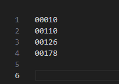
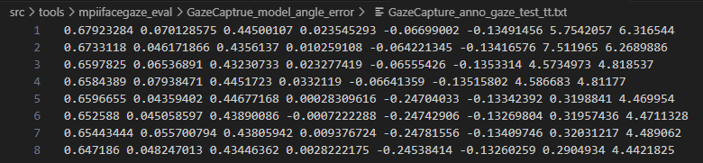
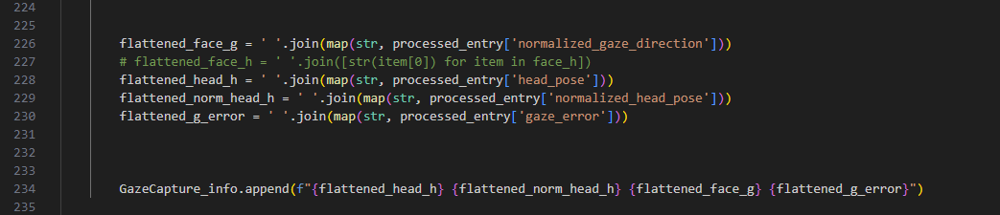

功能
---
用於輸出GazeCapture對應不同類型(All / Tablet / Phone)的Ground Truth，並且產生該數據的normalize gaze / normalize head_pose(上述內容是透過[faze_preprocess](https://github.com/swook/faze_preprocess/tree/master)參考)，同時會使用model輸出prediciton 與前述的normalize gaze / normalize head_pose 計算error，最終紀錄於.txt 文件，後續可以matplotlib 來輸出可視化的誤差曲線


輸入參數
---
- -p person_specific_txt_path (指定的person列表)
  - GazeCapture_person_specific_test_phone.txt
  - 

- -m model_path (model 的 weight path)
  - /home/owenserver/Python/CenterNet_gaze/exp/ctdet_gazeface/gazecapture/resdcnface_18/gaze_gazecapture_all_no_scp_f001_2/model_37.pth
- -t txt_path (輸出的txt 名稱)
  - GazeCapture_anno_gaze_test_phone.txt
  - 
  
執行cmd
---
```
python gc_model_angle_error.py -m /home/owenserver/Python/CenterNet_gaze/exp/ctdet_gazeface/gazecapture/resdcnface_18/gaze_gazecapture_all_no_scp_f001_2/model_37.pth -p GazeCapture_person_specific_test_tt.txt -t GazeCapture_anno_gaze_test_rrr.txt 
```


輸出的txt 格式
---
後續的matplotlib 會需要依據順序讀取txt 數據  
  
  


txt 對應位置的資料
0,1 -> 'h_rad_pitch','h_rad_pitch',  
2,3 -> 'normalized_h_rad_pitch','normalizedh_rad_pitch',  
4,5 -> 'normalized_vector_rad_pitch','normalized_vector_rad_yaw',  
6,7 ->　'vector_error_deg_pitch','vector_error_deg_yaw',  


資料夾檔案配置
---
GazeCaptrue_model_angle_error/    
└── gc_model_angle_error.py  
└── sfm_face_coordinates.npy (3D face_model)
└── image/ (存放mark down 說明影像)  
└── person_specific/ (指定的person列表)  
└── output/ (輸出的txt)


